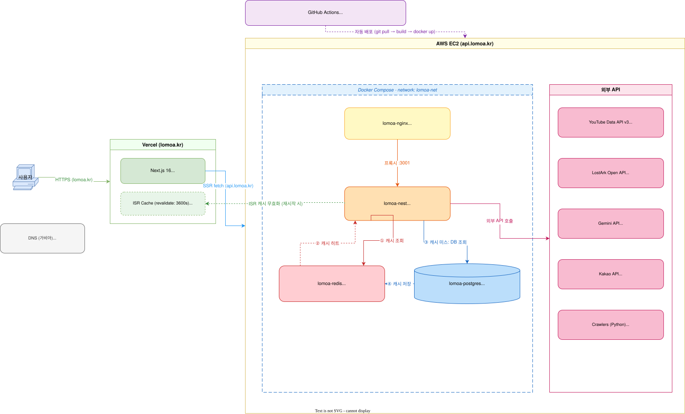

# lomoa - 로스트아크 커뮤니티 플랫폼

## 프로젝트 목표

- 로스트아크 게이머들이 필요한 도구를 빠르게 찾는 커뮤니티 허브 구축
- 사이트 모음, 실시간 방송(치지직·유튜브) 등 분산된 정보를 한 곳에서 탐색 가능하게 제공

## 기술 스택

- Docker
- pnpm 10: 패키지 매니저 (client·server 폴더별 독립)
- TypeScript: 타입 안정성으로 런타임 에러 사전 방지
- Next.js 16: 메인 페이지 ISR, 관리자 CSR (Vercel 배포)
- NestJS 11: 백엔드 API 서버
- PostgreSQL: 주 데이터베이스
- Prisma 7: ORM (driver adapter 방식)
- Redis: 캐시로 속도 개선
- Nginx: 리버스 프록시
- NVIDIA NIM (OpenAI 호환): 관리자 AI 진단·사이트 추천
- Sentry: 에러·성능 모니터링 (프론트·백엔드)
- AWS EC2 + GitHub Actions(ECR → SSM): 서버 배포 자동화
- Claude Code: AI 페어 프로그래밍

## 시스템 흐름:

원본 크기로 보기: [docs/architecture.svg](https://raw.githubusercontent.com/haihire/lomoa/main/docs/architecture.svg)
